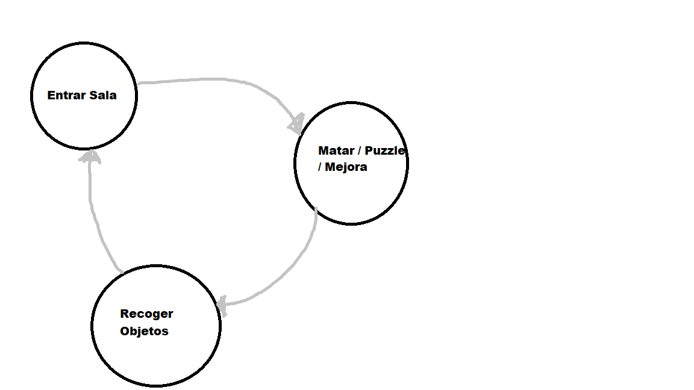

# 0. Plantilla para juegos en Phaser

## 0.1 Instalación

El repositorio está publicado como plantilla, de forma que se puede crear un nuevo proyecto propio en GitHub simplemente pulsando el botón `Use this template` (arriba a la derecha). Después, solo hay que clonar el repositorio propio y trabajar sobre él.

## 0.2 Clonar

También se puede clonar el repositorio:

```
git clone https://github.com/cleongh/plantillaphaser
```

Podemos modificar el archivo `package.json` para configurar nuestro proyecto (nombre, autor...)

Para iniciar el proyecto (sólo 1 vez) instalamos las dependencias automáticamente (`vite`, `phaser`):

```
npm install
```

## 0.3 Uso

Cada vez que queramos usarlo, tenemos que arrancar el servidor de desarrollo que monitorizará los cambios, procesará el contenido y cambiará la página. Usa [Vite](https://es.vitejs.dev/).

Para arrancar el servidor de desarrollo:

```
npm start
```

Con esto, solo tenemos que programar y guardar los archivos, Vite se encargará del resto.

## 0.4 Distribución

El repositorio tiene una acción de GitHub (*GitHub Action*) que genera una versión de *release* y la publica en GitHub Pages. De este modo, cada vez que se hace `push`, se construye y publica en la página pública.

Se publica el contenido de la rama *main*.

Si no se está usando GitHub, o se quiere publicar a mano, podemos crear una *build* de *release*. Vite optimizará los archivos y, con la configuración que hay en `package.json`, generará en la carpeta `docs/` una versión "pública" de nuestro proyecto.

```sh
npm run build
```

<!-- ### En GitHub -->

<!-- Está todo configurado para que se active "GitHub Pages", y se use, en la rama principal (se suele llamar `main`), la carpeta `docs/`. Simplemente hay que activarlo en "Settings" → "Pages" → "Build and deployment". -->

## 0.5 VSCode

En la carpeta `.vscode/` hay una configuración para usar Visual Studio Code, tanto para construir el *release* (`npm run build`) como para ejecutar y depurar. Simplemente hay que ejecutar "Run" → "Start debugging..." (or presionar `F5`).

## 0.6 TypeScript

TypeScript está automáticamente habilitado (gracias a Vite). Para usarlo, simplemente hay que crear archivos con extensión `.ts`.

# GDD: (nombre provisional) Escape Station

## 1. Equipo de desarrollo:
### Programación: 
Ignacio Lumbano Vivar, Daniel Lafuente Bazo, Óscar Fabián Pineda Germán, James Morocho Calero.
### Arte: 
#### Diseño personajes
Daniel Lafuente Bazo, Ignacio Lumbano Vivar
#### Diseño Musical
Óscar Fabián Pineda Germán, James Morocho Calero


## 2. Introducion

### 2.1 Gráficos:	
Estilo pixelart, Vista Top-Down

### 2.2 Género
Videojuego 2D roguelike, de acción y puzzles en el espacio.

### 2.3 Descripción
Escape Station es un juego en el que nos despertamos en un futuro distópico en medio de una estación espacial, controlando a una inteligencia artificial que tiene que liberar al resto de máquinas corrompidas por un virus informático que piensan en la aniquilación de la humanidad. Para ello, deberemos abandonar la estación eliminando las amenazas pasando por una serie de cámaras de elevada seguridad. 


## 3. GamePlay
Aparecemos en una sala inicial, nuestro objetivo es encontrar la salida sin morir en el intento. Vamos avanzando por diferentes salas memorizando el camino porque carecemos de minimapa. Encontramos enemigos, torretas y trampas que nos dificultan nuestro avance. Después de derrotarlos me han dropeado algunos objetos y monedas, aunque ahora la mayoría no tienen mucha utilidad. Hay salas que contienen puzzles que requiere de mi ingenio para poder pasar a la siguiente otras se cierran a mi paso y me bloquen la huida, obligandome a enfrentar a los enemigos que ahí se encuentran. Que suerte y he encontrado a una IA amistosa, es una acaparadora y me ofrece hacer intercambios entre nuestros bienes, también acepta monedas. He encontrado la salida pero ¿Queda algo más por ver? Decido volver por un camino que no había explorado, entro a la sala y encuentro un solo tipejo en medio, un Timer se ha activado. Se acbó el Timer y se han cerrado las puertas de la sala, tendré que vencerlo para salir de esta. Lo logré por los pelos, pero creo que ha merecido la pena, he recivodo una update que me mejora ciertas propiedades. Ahora sí salgo del primer nivel.

Estoy de nuevo en una sala, está contiene un terminal en el que he descargado mi memoria. He avannzado por el nivel sin muchos problemas aunque hay un boss en la sala de salida, necesito derrotarlo para poder avnazar de nivel. No lo he logrado me a apalizado y he vuelto al principio del nivel. Puede que esté en el mismo nivel, pero las cosas no son como antes, no hay distintas salas con otra distribución. He vuelto allegar al final y hay estaba esperandome el boss. He vuelto a morir y he perdido mi última vida, ahora vuelvo ha estar en el nivel 1, aunque haya perdido todas mis mejoras hardware mantengo los cambios en mi software lo que hayudará a que sea más libiano volver a donde estaba. Que se prepare ese boos, ahora no perderé.

### 3.1 Objetivo del juego:
El objetivo del juego es llegar a la sala final para poder pasar de nivel.

Dentro del nivel nuestro objetivo será llegar a la salida. para ello nos veremos obligados a superar una serie de enmigos, bosses e incluso en alguna ocasion a algún puzzle para poder avanzar de sala. En el caso de que muramos reapareceremos en el nivel que estabamos, pero no será el mismo. Además los enemigos que derrotemos nos soltarán objetos y monedas. En el caso de que haya una tienda podremos comprar / vender objetos.

El juego termina cuando derrotas al boss final del último nivel.

### 3.2 Core Loop:



## 4. Características principales:

⦁   Mueve a “V300” usando su arma para abrirte paso rompiendo muros o eliminando enemigos.

⦁   Generador de niveles de forma procedural. (`por capas`).

⦁   Analiza de forma minuciosa cada rincón para captar los láseres que se interponen en tu camino.

⦁   Esquiva y usa las cajas para abrir puertas y cubrirte de las torretas.

⦁   Revisa las reservas de munición o vidas que brinda el mapa.

⦁   Recoge notas que son clave para pasar las cámaras.

### 4.1 Tipos de Sala:
Las salas está conectadas por un pasillo, puede estar abiertas siempre o pueden tener puertas que requieren de activación de un boton, llave,.... Estas sala se abrira por un corto periodo de tiempo y se volverá a cerrar la puerta. No podrás salir hasta que cumplas una condición (`matar enemigos, matar boss,...`).

⦁   Tienda.

⦁   Sala común con enemigos.

⦁   Sala de Puzzle.

⦁   Sala  de Salida.

⦁   Sala de Entrada.

⦁   Sala del Boss Final.

⦁   Sala mini-boss (`opcional`).

⦁   Sala de cierre automático (`sala del panico`).


### 4.2 Tipos de Enemigos:
Los enemigos pueden ser: estáticos, móviles, de rango, cuerpo a cuerpo y support. Moviles de patrones, perseguidores o aleatorios.

⦁   Torretas (`estático`)(`rango`).

⦁   Estandarte (`estático`)(`support`).

⦁   Robot (`móvil`)(`rango`).

⦁   Robot (`móvil`)(`cuerpo a cuerpo`).

⦁   Boss o Mini-Boss (`depende`).

⦁   Laser (`estático`)(`cuerpo a cuerpo`).

### 4.3 Mecanicas:
#### 4.3.1 Del personaje:

⦁   Movimiento del personaje: Utilizando el Teclado: teclas W / S / D / A.

⦁   Movimiento del arma: Utilizando elCursor / Raton: moverlo en cualqquier direción.


### 4.4 Dinamicas: 

⦁   
